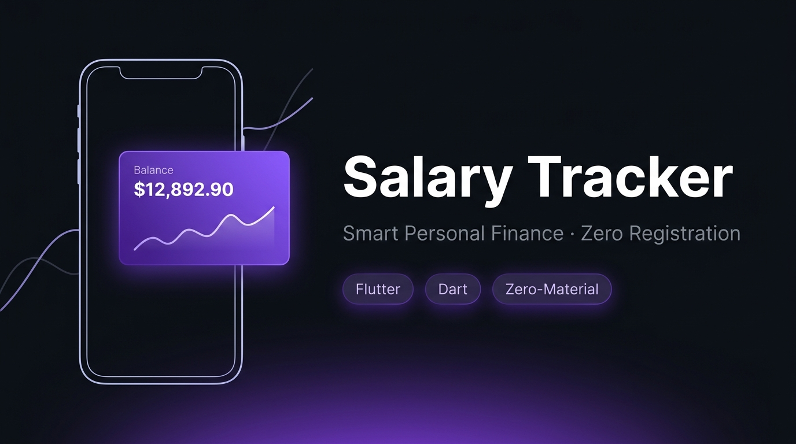
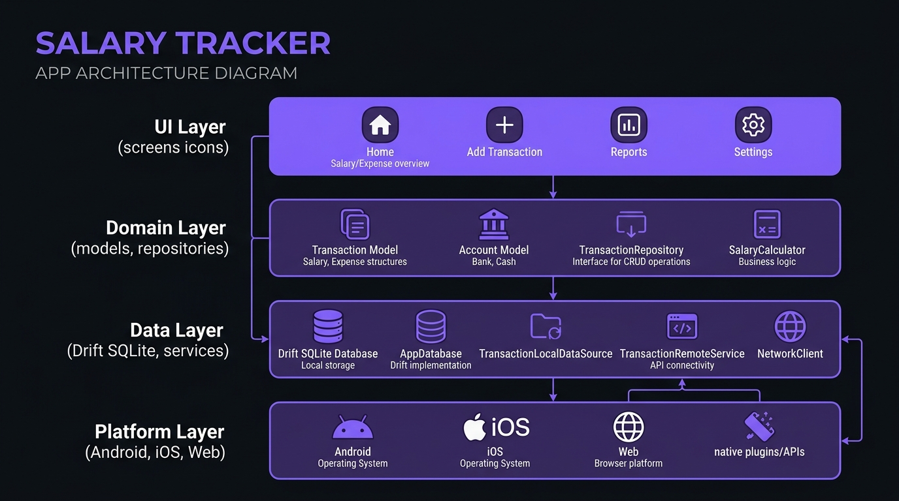
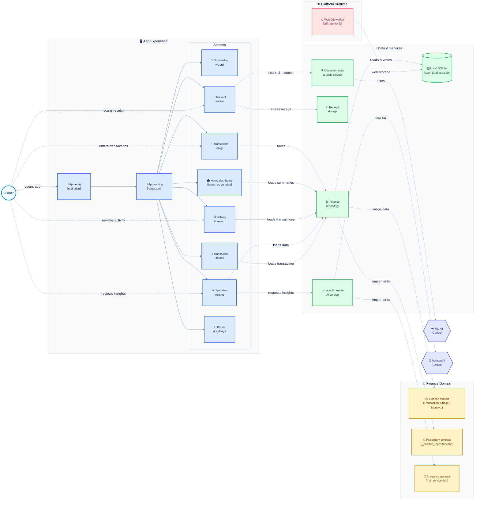

<div align="center">



# 💰 Salary Tracker — Smart Expense & Budget Manager

> **Production-quality personal finance app built with Flutter.**
> Zero registration · 100% offline · Zero Material/Cupertino widgets · AI-powered insights

[](https://flutter.dev)
[](https://dart.dev)
[](LICENSE)
[](test/)
[](https://flutter.dev/multi-platform)
[](tool/check_no_material.dart)

</div>

---

## 📖 Table of Contents

- [About the App](#-about-the-app)
- [Screenshots & UI](#-screenshots--ui)
- [Features](#-features)
- [Architecture](#-architecture)
- [Database Schema](#-database-schema)
- [Design System](#-design-system)
- [AI & OCR Pipeline](#-ai--ocr-pipeline)
- [Tech Stack](#-tech-stack)
- [Project Structure](#-project-structure)
- [Getting Started](#-getting-started)
- [Running Tests](#-running-tests)
- [Roadmap](#-roadmap)
- [Contributing](#-contributing)

---

## 🌟 About the App

**Salary Tracker** is a production-grade personal finance application that helps you track your salary, monitor daily spending, scan receipts, and get AI-powered budget insights — all **completely offline**, without any account creation or cloud dependency.

### 🎯 Core Philosophy

| Principle | Implementation |
|-----------|---------------|
| 🚫 Zero Registration | All data stays on your device — no email, no sign-up |
| 🔒 Privacy First | SQLite on-device storage, no analytics by default |
| 🎨 Zero Material | 100% custom design system — not a single `Material` or `Cupertino` widget |
| 🤖 Local AI | Rule-based forecasting runs entirely on-device |
| 🌐 Multi-Platform | One codebase → Android, iOS, and Web (PWA) |

---

## 📱 Screenshots & UI

<div align="center">

### 🏠 Home Dashboard

```
┌─────────────────────────┐
│  Welcome Back, Jacob    │  🔍 🔔
│  ───────────────────── │
│  ┌─────────────────────┐ │
│  │   Total Balance     │ │
│  │   $12,892.90        │ │  ← Live from DB
│  │  ┌──┬──┬──┐         │ │
│  │  │💰│💸│💾│         │ │
│  │  │8k│3k│2k│         │ │
│  │  └──┴──┴──┘         │ │
│  └─────────────────────┘ │
│  ✦ AI Insight Banner    │
│  Spending by Category   │
│  [Food][Rent][Transport] │
│  Recent Transactions ↓  │
│  ┌───────────────────┐  │
│  │ 🍕 Uber Eats  -$24│  │
│  │ 🏠 Rent    -$1,200│  │
│  └───────────────────┘  │
│  [🏠][📊][➕][🔍][👤] │  ← Frosted Nav
└─────────────────────────┘
```

### 📊 Spending Insights

```
┌─────────────────────────┐
│  Spending Insights      │
│  April 2026 ▾           │
│  [Week][Month][Year]    │
│  ┌───┬───┬───┬───┐      │
│  │$3k│$104│🍕│$212│    │  ← 2x2 Stat Grid
│  └───┴───┴───┴───┘      │
│  Spending Trend         │
│  ┌─────────────────────┐ │
│  │  /\    /            │ │  ← Area Line Chart
│  │ /  \--/  (Bezier)  │ │
│  └─────────────────────┘ │
│  Budget vs Actual       │
│  Food    [========] OVER│
│  Transport [===  ] Under│
│  Shopping  [====  ] OVER│
└─────────────────────────┘
```

### 🧾 Transaction Detail

```
┌─────────────────────────┐
│ ←  Transaction Detail … │
│                         │
│     🍕 Uber Eats        │
│     -$24.50             │
│   12 Apr · 1:42 PM      │
│   [Food] [AI ✦]         │
│                         │
│  ┌── AI Receipt Scan ───┐│
│  │ 🧾 Cheeseburger  $12 ││
│  │    Fries          $4 ││
│  │    Coke           $3 ││
│  │    Tax           $1.5││
│  │    Total        $24.5││
│  └──────────────────────┘│
│                         │
│  Merchant Info          │
│  🏪 Uber Eats, 4.8★     │
│  23 total visits        │
└─────────────────────────┘
```

</div>

---

## ✨ Features

### 💼 Financial Management

- **Real-time Balance Dashboard** — Income, Expenses, and Net Saved calculated live from your transaction history
- **Daily Budget Allowance** — Auto-calculated safe-to-spend amount based on your salary and pay schedule
- **Multi-account Support** — Checking, savings, credit card, and investment account tracking
- **CSV Export** — Export full transaction history as RFC-compliant CSV with one tap

### 📊 Smart Analytics

- **Spending Trends Chart** — Smooth monotone cubic Bézier area chart with scrub tooltip
- **Category Breakdown** — Visual spending breakdown with animated horizontal carousel
- **Budget vs Actual** — Per-category animated progress bars with over/under indicators
- **Month-over-Month Comparison** — Trend badges showing up/down percentage change
- **AI Savings Finder** — Automatic detection of recurring overruns and saving opportunities

### 🤖 AI-Powered Insights

- **Auto-Categorization** — Rule-based ML categorizes transactions by merchant name
- **Overrun Prediction** — Forecasts if you will exceed your monthly budget before month-end
- **Receipt Parser** — Extracts merchant name, line items, tax, and total from scanned receipts
- **Smart Notifications** — Budget alerts, salary reminders, and personalized insights
- **Optional Cloud AI** — Connect Gemini 1.5 Flash for advanced receipt parsing (opt-in)

### 📸 Receipt Scanning (Phase 12)

- **ML Kit Document Scanner** — Google's on-device document scanner with edge detection
- **On-Device OCR** — Google ML Kit Text Recognition for offline text extraction
- **Local Compression** — Receipt images compressed locally (WebP) to prevent storage bloat
- **Auto-fill** — Scanned receipt data auto-fills transaction title and amount

### 🚀 First-Time Experience (FTUE)

- **5-Step Onboarding Wizard** — Interactive setup with animated progress bar
- **Currency Selection** — USD, EUR, GBP, INR, JPY, CAD, AUD with live preview
- **Salary Engine** — Real-time daily allowance calculator with count-up animation
- **Demo vs Clean Mode** — Choose between seeded demo data or a fresh ledger
- **Confetti Launch** — Celebration animation on setup completion

### 🎨 Premium UI/UX

- **Glassmorphism Design** — Frosted glass surfaces throughout the app
- **Spring Animations** — Physics-based micro-animations on every interaction
- **Dark & Light Themes** — Complete dark and light mode with smooth switching
- **Custom Haptics** — Tactile feedback synchronized with UI interactions
- **Responsive Layout** — Adapts from 320px phones to 2-pane desktop layout

---

## 🏗️ Architecture



The app follows a strict **Clean Architecture** pattern with 4 distinct layers:

```
lib/
├── ui/                     # UI Layer — Screens & Widgets
│   └── screens/
│       ├── home/           # Home dashboard
│       ├── add_transaction/# Add/Edit transaction
│       ├── spending_insight/# Analytics & charts
│       ├── transaction_detail/
│       ├── activity/       # Cards & account activity
│       ├── profile/        # Settings & salary config
│       ├── search/         # Full-text search
│       ├── notifications/  # Alerts & insights
│       ├── see_all/        # Paginated lists
│       └── scanner/        # Receipt scanner review
│
├── domain/                 # Domain Layer — Business Logic
│   ├── models/             # Immutable value objects
│   ├── repositories/       # Repository interfaces
│   └── services/           # Service interfaces
│
├── data/                   # Data Layer — Persistence & I/O
│   ├── database/           # Drift SQLite schema & DAOs
│   ├── repositories/       # Concrete implementations
│   ├── services/           # Local AI, OCR, storage
│   └── seed/               # Mockup seed data
│
├── design_system/          # Design System — 100% Custom
│   ├── tokens/             # Colors, typography, spacing
│   └── components/         # 25+ reusable primitives
│
├── features/               # Feature Modules
│   └── onboarding/         # FTUE wizard & state
│
└── providers/              # Riverpod State Management
    └── finance_providers.dart
```

### State Management Flow

```
Riverpod Provider → Repository → Drift DAO → SQLite
      ↓                                         ↑
  UI Widget ←── StreamProvider ←── Reactive Stream
```

### 🗺️ Interactive Codebase Map

> Generated by [gitdiagram.com](https://gitdiagram.com/manish-sherawat/expence-track) — click any node to jump to the source file.



---

## 🗄️ Database Schema

Built on **Drift (SQLite)** with full type-safety and reactive streams:

```
┌──────────────────────────────────────────────────────────────┐
│                    DATABASE SCHEMA                           │
├──────────────────┬───────────────────────────────────────────┤
│   ACCOUNTS       │  id, name, type, balanceMinor, lastFour   │
├──────────────────┼───────────────────────────────────────────┤
│   CATEGORIES     │  id, name, iconKey, colorHex, budget      │
├──────────────────┼───────────────────────────────────────────┤
│   MERCHANTS      │  id, name, category, visitCount, address  │
├──────────────────┼───────────────────────────────────────────┤
│   TRANSACTIONS   │  id, accountId, categoryId, amountMinor,  │
│                  │  timestamp, title, aiSuggestedCategory     │
├──────────────────┼───────────────────────────────────────────┤
│   RECEIPTS       │  id, transactionId, merchantName, total,  │
│                  │  subtotal, tax, rawOcrText, imageUrl       │
├──────────────────┼───────────────────────────────────────────┤
│   RECEIPT_ITEMS  │  id, receiptId, name, quantity, price     │
├──────────────────┼───────────────────────────────────────────┤
│   BUDGETS        │  id, categoryId, limitMinor, spentMinor   │
├──────────────────┼───────────────────────────────────────────┤
│   SALARY_PROFILE │  monthlyGross, monthlyNet, payDayOfMonth, │
│                  │  employerName, taxWithheld, savingsGoal    │
├──────────────────┼───────────────────────────────────────────┤
│   INSIGHTS       │  id, title, type, impactAmount, route     │
├──────────────────┼───────────────────────────────────────────┤
│   APP_SETTINGS   │  key, value  (key-value store)            │
└──────────────────┴───────────────────────────────────────────┘
```

> 💡 All monetary values are stored in **minor units (cents)** as integers to avoid floating-point precision issues.

---

## 🎨 Design System

A fully custom design system — **zero Material Design widgets** — built from scratch with token-driven architecture:

### Color Tokens

| Token | Dark Mode | Light Mode | Usage |
|-------|-----------|------------|-------|
| `background` | `#0B0D12` | `#F5F6FA` | Screen background |
| `surface` | `#151820` | `#FFFFFF` | Cards & sheets |
| `accent` | `#FF6B35` | `#FF6B35` | Primary CTA |
| `positive` | `#30D158` | `#28B14C` | Income / under budget |
| `ink` | `#FFFFFF` | `#0B0D12` | Primary text |
| `subtext` | `#8A8F9E` | `#6B7180` | Secondary text |

### Typography

```
Inter Variable Font
├── Display:   56sp · Bold     → Balance amount ($12,892.90)
├── Title 1:   28sp · SemiBold → Screen headers
├── Title 2:   22sp · SemiBold → Section headers
├── Body:      16sp · Regular  → Transaction titles
├── Caption:   13sp · Regular  → Metadata & timestamps
└── Micro:     11sp · Medium   → Chips & badges
    All use tabular figures (tnum) for aligned number columns
```

### Component Library (25+ Custom Widgets)

| Component | Description |
|-----------|-------------|
| `Pressable` | Custom gesture detector — 0.97x scale + 85% opacity + haptics |
| `GlassSurface` | BackdropFilter blur + white 55% tint + hairline border |
| `AppButton` | Primary / secondary / ghost / destructive variants |
| `FrostedNavBar` | Floating pill nav with spring-sliding active bubble |
| `AreaLineChart` | CustomPainter monotone cubic Bézier with scrub tooltip |
| `AmountKeypad` | Custom 0–9 numeric keypad with haptic feedback |
| `SegmentedControl` | Sliding white thumb with spring physics |
| `DropdownPill` | OverlayPortal popover with outside-tap dismiss |
| `StatCard` | Stat display with trend badge (up/down percentage) |
| `TransactionTile` | Avatar, AI chip, amount, swipe-to-delete |
| `ProgressBar` | Animated 6pt rounded bar for budget tracking |
| `Skeleton` | Custom ShaderMask shimmer loading placeholder |
| `AppDatePicker` | Custom month grid + time wheel (no Material) |
| `AppTextField` | EditableText with custom focus ring |
| `BottomSheet` | Drag handle + velocity dismissal + glass surface |
| `Toast` | Glass overlay notification system |
| `PullToRefresh` | Custom sliver refresh indicator |
| `TagChip` | Neutral / AI sparkle / warning / positive variants |
| `StatusPill` | Over / Under budget indicator pill |
| `AppIcon` | 20+ custom vector painter icons (no icon fonts) |
| `AmountText` | Split whole/cents rendering with tabular figures |
| `InsightBanner` | AI insight card with sparkle icon |
| `CategoryCard` | Horizontal category spending card |
| `ReceiptCard` | Perspective-tilted receipt with line items |
| `MerchantCard` | Merchant info with visit count |

---

## 🤖 AI & OCR Pipeline

```
User taps "Scan Receipt"
         │
         ▼
┌─────────────────────┐
│ ML Kit Doc Scanner  │  ← Google's native document scanner
│ (google_mlkit_doc.) │    edge detection + perspective correction
└─────────┬───────────┘
          │ image file path
          ▼
┌─────────────────────┐
│  MlKitOcrService    │  ← On-device text recognition
│  (Latin script OCR) │    No internet required
└─────────┬───────────┘
          │ raw OCR text
          ▼
┌─────────────────────┐
│  LocalAiService     │  ← Rule-based parser
│  parseReceiptText() │    Extracts: merchant, items,
└─────────┬───────────┘    tax, total, date
          │ ParsedReceipt
          ▼
┌─────────────────────┐
│ Auto-fill UI Fields │  ← Title + Amount populated
│ + Save to Drift DB  │    Receipt stored locally (WebP)
└─────────────────────┘
          │ (optional)
          ▼
┌─────────────────────┐
│ RemoteAiService     │  ← Gemini 1.5 Flash API
│ (opt-in, Pro tier)  │    Advanced decomposition
└─────────────────────┘
```

### Auto-Categorization Rules

```dart
// Rule-based merchant → category mapping
"uber eats" | "doordash" | "grubhub" → Food & Dining
"netflix"   | "spotify"  | "apple"   → Entertainment
"bp"        | "shell"    | "chevron" → Transport
"amazon"    | "walmart"  | "target"  → Shopping
"cvs"       | "walgreens"           → Health
```

---

## 🛠️ Tech Stack

| Layer | Technology | Purpose |
|-------|-----------|---------|
| **Framework** | Flutter 3.x (Dart 3.x) | Cross-platform UI |
| **State** | Riverpod 2.x | Reactive state management |
| **Navigation** | go_router 14.x | Declarative routing |
| **Database** | Drift 2.x + SQLite | Type-safe local persistence |
| **Web DB** | sqlite3.wasm + drift_worker.js | Browser WebAssembly SQLite |
| **OCR** | google_mlkit_text_recognition | On-device text recognition |
| **Scanner** | google_mlkit_document_scanner | Document capture & edge detection |
| **Images** | image 4.x | Local WebP compression |
| **Storage** | path_provider | Platform file paths |
| **Fonts** | Inter Variable (local) | Custom typography |
| **SVG** | flutter_svg | Vector icon rendering |
| **i18n** | intl 0.20 | Number & date formatting |

### Dev Dependencies

| Tool | Purpose |
|------|---------|
| `drift_dev` + `build_runner` | Code generation for Drift DAOs |
| `flutter_lints` | Strict lint rules |
| `flutter_test` | Widget & unit testing |

---

## 📁 Project Structure

```
salary_tracker/
├── pubspec.yaml              # Dependencies & assets
├── analysis_options.yaml     # Strict Dart analyzer config
├── TASKS.md                  # Phase-by-phase implementation tracker
├── ROADMAP_TO_FINAL_PRODUCT.md
│
├── lib/
│   ├── main.dart             # App entry point
│   ├── app/
│   │   ├── app.dart          # WidgetsApp.router root
│   │   └── router.dart       # go_router config + guards
│   ├── design_system/
│   │   ├── tokens/           # AppColors, AppTypography, AppSpacing...
│   │   ├── components/       # 25+ custom widgets
│   │   └── gallery/          # Interactive component showcase (/gallery)
│   ├── domain/
│   │   ├── models/           # Transaction, Account, Budget, Money...
│   │   ├── repositories/     # IFinanceRepository interface
│   │   └── services/         # IOcrService, IAiService interfaces
│   ├── data/
│   │   ├── database/         # Drift tables, DAOs, AppDatabase
│   │   ├── repositories/     # FinanceRepository (Drift impl)
│   │   ├── services/         # LocalAiService, MlKitOcrService...
│   │   └── seed/             # MockupSeedData
│   ├── features/
│   │   └── onboarding/       # 5-step FTUE wizard
│   ├── providers/            # Riverpod StreamProviders
│   └── ui/screens/
│       ├── home/
│       ├── add_transaction/
│       ├── spending_insight/
│       ├── transaction_detail/
│       ├── activity/
│       ├── profile/
│       ├── search/
│       ├── notifications/
│       ├── see_all/
│       └── scanner/
│
├── test/
│   ├── app_boot_test.dart
│   ├── no_material_guard_test.dart
│   ├── data/                 # Repository & service tests
│   ├── design_system/        # Component widget tests
│   ├── domain/               # Money & model tests
│   ├── features/             # Onboarding tests
│   ├── integration/          # End-to-end flow tests
│   ├── screens/              # Screen-level widget tests
│   └── services/             # OCR, AI, storage tests
│
├── tool/
│   ├── check_no_material.dart  # Zero-Material guard script
│   ├── check_no_material.sh
│   └── check_no_material.bat
│
├── web/
│   ├── index.html            # PWA shell
│   ├── manifest.json         # PWA manifest
│   ├── sqlite3.wasm          # WebAssembly SQLite
│   └── drift_worker.js       # Web DB worker
│
├── android/                  # Android config & permissions
├── ios/                      # iOS config & privacy strings
└── docs/
    ├── images/               # README assets
    └── superpowers/          # Implementation plans & specs
```

---

## 🚀 Getting Started

### Prerequisites

- [Flutter SDK](https://flutter.dev/docs/get-started/install) >= 3.0.0
- [Dart SDK](https://dart.dev/get-dart) >= 3.0.0
- Android Studio / Xcode (for mobile targets)
- A physical device or emulator

### 1. Clone the Repository

```bash
git clone https://github.com/manish-sherawat/expence-track.git
cd expence-track
```

### 2. Install Dependencies

```bash
flutter pub get
```

### 3. Run Code Generation (Drift DAOs)

```bash
dart run build_runner build --delete-conflicting-outputs
```

### 4. Run the App

```bash
# Android / iOS
flutter run

# Web (with WebAssembly SQLite support)
flutter run -d chrome --web-renderer canvaskit
```

### 5. Verify Zero-Material Compliance

```bash
dart run tool/check_no_material.dart
# Expected: SUCCESS: Verified 0 Material and 0 Cupertino imports
```

---

## 🧪 Running Tests

### Full Test Suite

```bash
flutter test
# Expected: All 94 tests pass
```

### Static Analysis

```bash
flutter analyze
# Expected: No issues found!
```

### Test Coverage Breakdown

| Test Category | Count | Status |
|--------------|-------|--------|
| App boot & router | 3 | ✅ |
| Zero-Material guard | 1 | ✅ |
| Design system components | 12 | ✅ |
| Domain models (Money) | 8 | ✅ |
| Database (Drift CRUD) | 6 | ✅ |
| Onboarding wizard | 16 | ✅ |
| Screen widget tests | 30 | ✅ |
| Service tests (OCR, AI) | 10 | ✅ |
| Integration (E2E flows) | 8 | ✅ |
| **Total** | **94** | **All Passing** |

---

## 🗺️ Roadmap

### Completed Phases

| Phase | Description | Status |
|-------|-------------|--------|
| 0 | Project setup, guardrails, CI | Done |
| 1 | Design system tokens & primitives | Done |
| 2 | Complete component library (25+ widgets) | Done |
| 3 | Drift database, domain models, seed data | Done |
| 4 | Home screen with live financial summary | Done |
| 5 | Transaction detail & receipt scan UI | Done |
| 6 | Spending insights with chart & budgets | Done |
| 7 | All tabs — Add, Cards, Profile, Search | Done |
| 8 | Local AI auto-categorization & insights | Done |
| 9 | Animations, accessibility, Web/Responsive | Done |
| 10 | Testing, hardening, release build config | Done |
| 11 | FTUE onboarding wizard (5-step) | Done |
| 11.5 | Production readiness, dynamic binding | Done |
| 12 | Hardware camera OCR (ML Kit) | Done |

### Upcoming Phases

```
Phase 13: Biometric Security & App Lock
├── Face ID, Touch ID, Android Biometrics (local_auth)
├── Privacy screen blur in multitasker
└── Secure token storage (flutter_secure_storage)

Phase 14: Native Platform Polish
├── Custom adaptive app icon (all densities)
├── Native launch splash screen
└── Home screen widgets (iOS WidgetKit / Android Glance)

Phase 15: Bank Integration (Pro)
├── Plaid / Teller API bank feed sync
├── Auto transaction reconciliation
└── Background sync workers

Phase 16: Store Launch
├── Google Play Store (AAB signing)
├── Apple App Store (provisioning)
└── Privacy Policy & Terms of Service
```

---

## 📊 Codebase Metrics

```
┌──────────────────────────────────────┐
│          CODEBASE METRICS            │
├──────────────────┬───────────────────┤
│  Lines of Code   │      ~18,000+     │
│  Dart Files      │         135+      │
│  Custom Widgets  │          25+      │
│  DB Tables       │          10       │
│  Automated Tests │      94 / 94      │
│  Analyzer Warns  │           0       │
│  Material Widgets│           0       │
│  Target Platforms│ Android·iOS·Web   │
└──────────────────┴───────────────────┘
```

---

## 🔐 Permissions

### Android (`AndroidManifest.xml`)

| Permission | Reason |
|-----------|--------|
| `INTERNET` | Optional cloud AI receipt parsing |
| `USE_BIOMETRIC` | Future biometric app lock |
| `CAMERA` | Receipt scanning via ML Kit |

### iOS (`Info.plist`)

| Key | Reason |
|-----|--------|
| `NSCameraUsageDescription` | Receipt capture with ML Kit scanner |
| `NSPhotoLibraryUsageDescription` | Import receipt images |
| `NSFaceIDUsageDescription` | Future biometric unlock |

---

## 🤝 Contributing

Contributions are welcome! Please follow these rules:

1. **Zero Material / Cupertino** — Never import `material.dart` or `cupertino.dart`. Run the guard script before opening a PR.
2. **Test Coverage** — All new features must include widget or unit tests.
3. **Static Analysis** — `flutter analyze` must return 0 issues.
4. **Money Arithmetic** — Always use the `Money` value object (integer minor units). Never use `double` for currency.

```bash
# Before opening a PR, verify all three:
dart run tool/check_no_material.dart  # Must pass
flutter analyze                        # 0 issues
flutter test                           # All green
```

---

## 📄 License

This project is licensed under the **MIT License** — see the [LICENSE](LICENSE) file for details.

---

## Disclaimer

> Salary Tracker is a personal expense tracking tool and does **not** provide certified financial, legal, or investment advice. All budgeting suggestions and AI insights are estimates based on your entered data only.

---

<div align="center">

Made with Flutter · Drift · Riverpod

**[Star this repo](https://github.com/manish-sherawat/expence-track)** if you found it useful!

</div>
